# Od blokirajućeg I/O-a do io_uring-a

## 1. Od mrežnog zahteva do čitanja fajla

Posmatrajmo primer kada server prima ime fajla, čita fajl i šalje njegov sadržaj klijentu. Server je ovde aplikacija koja radi na računaru. Klijent joj šalje poruku `POŠALJI tekst.txt`, završenu znakom za novi red. Poruka traži čitanje imenovanog fajla; sam sadržaj fajla nalazi se na serveru.

Pretpostavimo da su TCP konekcije A i B već uspostavljene. TCP prenosi uređen niz bajtova, ali jedan prijem ne mora sadržati celu poruku. Klijent A je poslao `POŠALJI te`, a ostatak šalje kasnije. Klijent B je već poslao celu poruku. Pitanje je kako aplikacija može da obradi B dok još čeka ostatak zahteva A.

### Prijem poruke i čitanje sadržaja fajla

Mrežna kartica je uređaj koji prima i šalje mrežne podatke. Za prenos primljenih podataka sa kartice u RAM uobičajeno se koristi DMA: uređaj prenosi podatke u memoriju bez potrebe da procesor kopira svaki bajt. Kernel zatim obrađuje mrežne podatke i povezuje ih sa odgovarajućom konekcijom.

Socket je objekat kojim operativni sistem predstavlja mrežnu komunikaciju aplikacije. Svaki TCP socket u našem primeru ima svoj prijemni bafer kojim upravlja kernel. To je memorija za podatke primljene preko te konekcije, a ne zaseban hardverski bafer na kartici. Aplikacija socket-u pristupa preko deskriptora (file descriptor), celog broja koji identifikuje otvoreni resurs u procesu.

Dok aplikacija ne pročita pristigle bajtove, oni čekaju u memoriji koju održava kernel. `recv(socket, buf, n)` kopira do `n` dostupnih bajtova u bafer aplikacije `buf`. Tako aplikacija dobija poruku `POŠALJI tekst.txt` i saznaje koji fajl klijent traži.

Tek tada otvara taj fajl i poziva `read(fd_fajla, buf_fajla, n)` da pročita njegov sadržaj. Kernel sadržaj može već imati u RAM-u, u page cache-u, ili ga mora pribaviti sa SSD-a. recv() nad socket-om i read() nad otvorenim fajlom čitaju različite podatke: prvi poruku klijenta, drugi sadržaj traženog fajla.

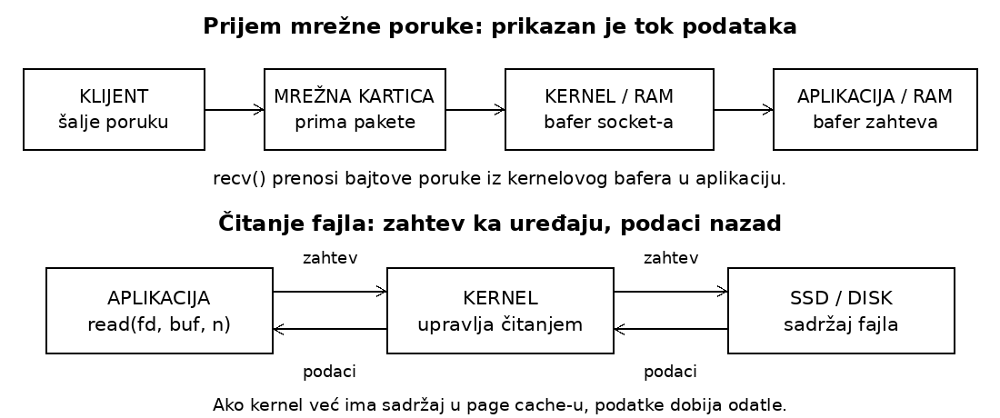

Slika 1. Gore strelice prate mrežne podatke. Dole gornje strelice prikazuju zahtev za čitanje, a donje vraćanje sadržaja fajla u aplikaciju.

Kernel može da primi B-ove bajtove i smesti ih u njegov prijemni bafer i dok aplikacija trenutno čita A. Dolazak podataka i njihova obrada u aplikaciji zato su dva različita koraka. Način organizacije aplikacije određuje kada će B doći na red.

Za jedan klijentov zahtev aplikacija obavlja tri vrste I/O operacija: primi poruku, pročita fajl, pošalje odgovor. Sada posmatrajmo šta se dešava ako jedan thread te korake izvršava redom.

## 2. Jedan thread i blokirajući pozivi

Počnimo od aplikacije sa jednim threadom za obradu oba klijenta. On prvo prima celu poruku A, čita traženi fajl i šalje odgovor A, pa tek onda prelazi na B. Thread poziva `recv(A)`, dobije `POŠALJI te` i ponovo pozove `recv(A)`, jer još nije stigao znak za kraj poruke.

Blokirajući poziv sme da zaustavi thread dok rezultat ne bude dostupan. Ako više nema pristiglih bajtova, blokirajući `recv(A)` uspava taj jedini thread. Naredna instrukcija njegovog koda čeka povratak iz poziva. B-ova cela poruka već je u kernelovom baferu, ali aplikacija nema drugi thread koji bi pozvao `recv(B)`.

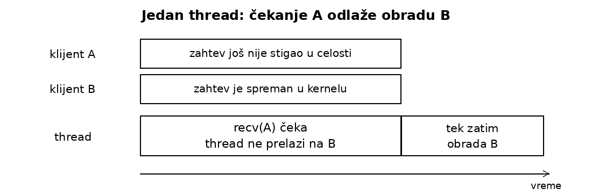

Slika 2. Samo jedan thread: dok čeka A, niko u toj aplikaciji ne obrađuje B.

Ograničenje: jedan thread pokušava da primi celu poruku A i obradi njen zahtev pre nego što pređe na B. Čekanje nepotpunog zahteva A zato odlaže spreman zahtev B. Procesor može da izvršava druge programe, ali naš server nema drugi tok izvršavanja koji bi nastavio obradu.

Da B ne bi čekao A, možemo u istoj aplikaciji pokrenuti još jedan thread i njemu dodeliti B. Oba threada pripadaju istom procesu, ali mogu nezavisno da napreduju.

## 3. Više threadova i thread pool

Sada isti serverski proces ima dva threada, po jedan za svaku konekciju. Thread A može da čeka ostatak poruke A, dok thread B primi svoj zahtev, pročita fajl i pošalje odgovor. Čekanje jednog threada ne zaustavlja drugi.

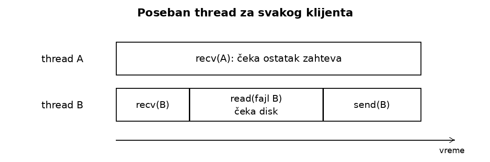

Slika 3. Thread B napreduje nezavisno od čekanja threada A. Vremenske dužine su ilustrativne.

Dobitak: B se obrađuje dok A čeka. Cena: svaki thread zahteva stek i dodatno stanje. Ako imamo mnogo konekcija koje uglavnom čekaju, održavamo mnogo threadova sa malo stvarnog rada. Za zajedničke podatke može biti potrebna sinhronizacija.

### Ograničen broj radnih threadova

Umesto novog threada za svaki posao, napravimo nekoliko radnih threadova i red poslova. Slobodan radnik uzima sledeći posao; po završetku vraća se po naredni. Takav skup radnika naziva se thread pool.

Sa dva radnika A i B mogu da se obrađuju, dok C i D čekaju u redu. Ako oba radnika čekaju I/O, niko još ne uzima C. Time smo ograničili broj threadova, ali čekanje i dalje zauzima radnika.

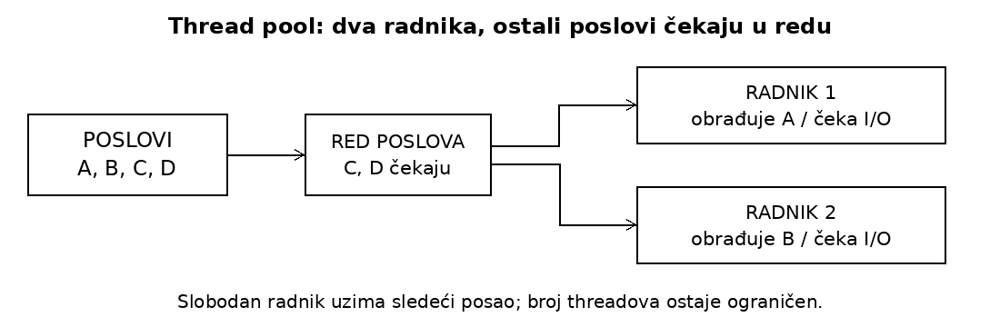

Slika 4. Thread pool ograničava broj radnika, ali blokirajuća operacija i dalje zauzima jednog radnika.

Ovde jedan posao znači obradu klijentskog zahteva od prijema do odgovora. Radnik zato ostaje zauzet i dok čeka podatke tog klijenta. Ograničili smo broj threadova, ali nismo promenili način čekanja. Sledeći korak je da konekcije koje trenutno nemaju podatke ne zauzimaju radnika.

## 4. Event loop i epoll

### Zajedničko čekanje na više konekcija

Vratimo se A i B. A još nema ostatak poruke; B već ima celu poruku u kernelovom baferu. Do sada smo klijentu dodeljivali thread koji čeka njegove podatke. Možemo promeniti redosled: najpre saznati za kog klijenta podaci već postoje, pa tek onda čitati njegov socket.

Za to koristimo `epoll`. Pozivom `epoll_ctl()` dodamo socket-e A i B na spisak konekcija koje želimo da pratimo. Kernel pamti taj spisak. Kada pozovemo `epoll_wait()`, pitamo koji od tih socket-a je spreman. U sledećem pozivu ne moramo ponovo da navedemo A i B; već su dodati. Spisak menjamo kada dodamo ili uklonimo konekciju, odnosno promenimo događaje koje pratimo.

`select()` i `poll()` takođe omogućavaju čekanje na više deskriptora. Razlika je što im pri svakom čekanju prosleđujemo skup koji treba pratiti, dok ga kod `epoll`-a održavamo odvojeno od čekanja.

Jedan thread servera sada ponavlja: sačekaj spremne socket-e, pročitaj dostupne podatke, obavi kratak korak obrade. Ovakva organizacija zove se event loop. Kada A nema novih podataka, thread se ne zaustavlja u `recv(A)`, već obrađuje spremni B.

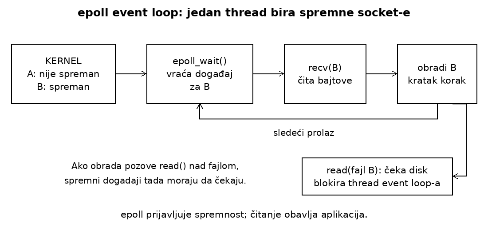

Slika 5. Thread najpre čeka obaveštenje o dostupnim podacima, pa tek onda čita odgovarajući socket.

```text
postavi socket-e u neblokirajući režim
registruj ih u epoll-u

while server_radi:
    događaji = epoll_wait()
    for događaj in događaji:
        rezultat = recv(događaj.socket, bafer)
        if nema dostupnih podataka (EAGAIN):
            continue
        if veza je zatvorena ili postoji druga greška:
            ukloni i zatvori socket
            continue
        dodaj bajtove ranije primljenom delu poruke
        if stigao je znak za novi red:
            započni obradu celog zahteva
```

Ako nijedan socket nije spreman, `epoll_wait()` uspava thread do sledećeg događaja. Pojedinačni `recv()` ipak ne sme da zaustavi ceo event loop. Zato koristimo neblokirajuće socket-e: ako trenutno nema podataka, poziv prijavljuje `EAGAIN` umesto čekanja. U ovom primeru `epoll_wait()` nastavlja da prijavljuje socket kao spreman dok u njemu ima nepročitanih podataka.

### Šta tačno vraća epoll?

`epoll_wait()` vraća informaciju poput „na socket-u B ima podataka za čitanje“. Ne vraća samu poruku `POŠALJI tekst.txt`. Nju aplikacija dobija narednim pozivom `recv(B)`. Taj model nazivamo obaveštavanjem o spremnosti, odnosno readiness.

Ako `recv(A)` vrati samo `POŠALJI te`, event loop sačuva taj deo uz klijenta A i nastavi da obrađuje B. Kada za A stigne `kst.txt` i novi red, naredni `recv(A)` dopuni sačuvanu poruku. Pravilo da se poruka završava novim redom deo je našeg protokola, dogovora klijenta i servera o formatu poruka. Jedan poziv ne mora dati celu poruku, pa aplikacija prati koliko je primila.

Dobili smo način da jedan thread obrađuje mnogo konekcija bez čekanja samo jednog klijenta. Međutim, taj thread izvršava sve korake event loop-a. Ako posle prijema B blokirajuće čita njegov fajl ili dugo računa, ostali događaji čekaju. Rešili smo čekanje mrežnih podataka, ali čitanje fajla može ponovo zaustaviti obradu drugih klijenata.

### Event loop i thread pool

Razlika se najlakše vidi kada A nema podatke. U ranijem pool-u radnik je dodeljen A i ostaje zauzet dok čeka njegovu poruku. U event loop-u sačuvamo ono što je A već poslao i pređemo na B; nijedan thread ne čeka isključivo A.

Event loop određuje kada ćemo napraviti sledeći korak za neku konekciju. Thread pool daje više radnika kojima možemo dodeliti poslove. Zato mogu da rade zajedno: event loop prati mrežne konekcije, a slobodnom radniku zada čitanje fajla koje bi ga inače zaustavilo.

### Čitanje fajla uz thread pool

Kada event loop primi B-ovo ime fajla, doda posao „pročitaj fajl B“ u red pool-a i nastavi da prati socket-e. Drugi thread, radnik pool-a, preuzme taj posao i pozove `read()`. Ako čitanje čeka SSD, čeka radnik. Thread koji izvršava event loop za to vreme može da obrađuje A ili druge klijente. Kada radnik objavi rezultat, event loop nastavi slanje odgovora B.

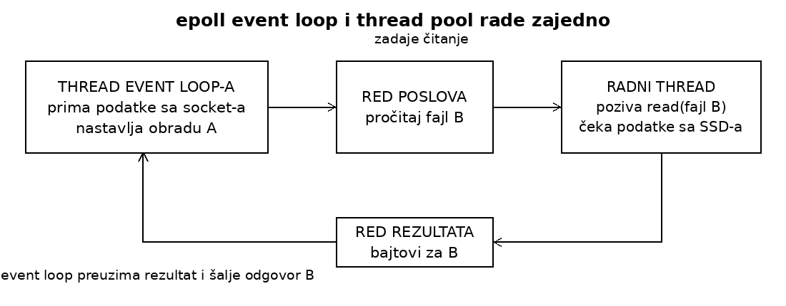

Slika 6. Event loop upravlja konekcijama, a radni thread izvršava čitanje fajla koje može da čeka.

Ovim ne tvrdimo da je jedan thread uvek brži od više threadova. Event loop smanjuje potrebu da radnici čekaju mrežne podatke. Pool omogućava da se čitanje fajla ili duža obrada izvrše u drugim threadovima. Broj radnika i dalje ograničava koliko takvih poslova može istovremeno da traje.

Običan fajl ne možemo registrovati u `epoll` na isti način kao socket; takva registracija tipično vraća `EPERM`. Kombinacija sa pool-om nam već daje željeno ponašanje: zadaj čitanje, nastavi drugi posao, kasnije preuzmi rezultat. Sledeći odeljak opisuje interfejse u kojima je baš to osnovni način rada.

## 5. Asinhroni I/O

U kombinaciji iz prethodnog odeljka thread koji izvršava event loop nije čekao SSD; to je radio radnik. Za event loop čitanje je zato već bilo asinhrono: zadavanje i preuzimanje rezultata bili su odvojeni.

Asinhroni I/O taj odnos izražava kroz sam interfejs. Thread najpre pošalje zahtev za čitanje, a rezultat preuzima odvojeno. Između ta dva koraka može da radi nešto drugo. Uprošćena ideja je:

```text
čitanje = pokreni_čitanje(fajl_B, početak=0, broj=4096, bafer_B)
obradi_spremne_podatke_klijenta_A()
rezultat = sačekaj_završetak(čitanje)
ako je čitanje uspelo:
    koristi rezultat.broj_bajtova iz bafera_B
```

Ovo je pseudokod ideje, ne konkretan API. `pokreni_čitanje` prihvata zahtev; ne vraća pročitani sadržaj. Kasniji završetak može da kaže: „u bafer B upisano je 4096 bajtova“ ili da prijavi grešku. Ako rezultat još nije gotov kada nam zatreba, i dalje moramo da čekamo.

Obaveštenje o završetku operacije naziva se completion. I prijem mrežnih podataka možemo organizovati na ova dva načina. Sa `epoll`-om prvo saznajemo da je socket spreman, a zatim pozivamo `recv()`. Sa asinhronim prijemom unapred zadajemo čitanje u određeni bafer i kasnije dobijamo broj bajtova koji su u njega upisani.

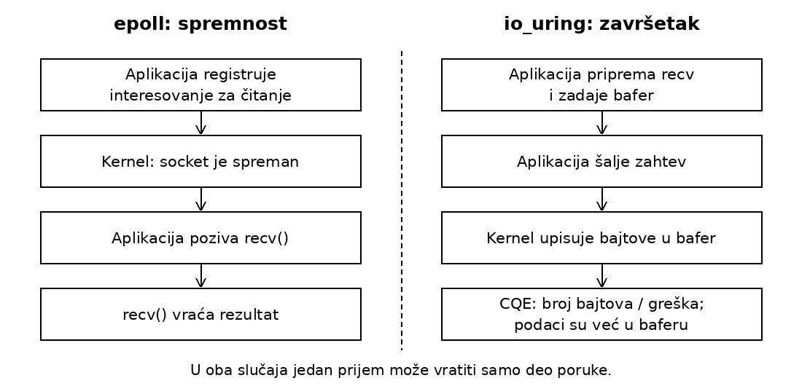

Slika 7. Prvo obaveštenje prethodi čitanju; drugo kaže koliko je bajtova već upisano u bafer.

To ne znači da je stigla cela poruka našeg protokola. „Operacija je završena“ može značiti da je pročitano pet bajtova, a nama treba cela poruka završena novim redom. To pravilo i dalje proverava aplikacija. Nula može označavati da je druga strana zatvorila slanje, a greška da čitanje nije uspelo.

### Raniji interfejsi

POSIX AIO definiše `aio_read()` i `aio_write()`. Na Linux-u ih glibc, C biblioteka koju aplikacija koristi, implementira preko svojih radnih threadova. Naš thread zada čitanje i nastavlja dalje; thread biblioteke u pozadini izvrši čitanje i sačeka njegov rezultat. Aplikacija dobija asinhroni interfejs, iako čekanje u implementaciji obavlja drugi thread. To je slična organizacija kao kod thread pool-a.

Linux native AIO, često korišćen preko `libaio`, zaseban je interfejs sa `io_submit()` za slanje i `io_getevents()` za završetke. Njegova istorijska asinhrona primena bila je prvenstveno vezana za I/O operacije sa diskom u direktnom režimu.

Pri uobičajenom čitanju fajla Linux koristi page cache: kernel u RAM-u čuva delove sadržaja fajlova. Ako traženi deo već postoji tu, `read()` može da dobije podatke iz RAM-a umesto ponovnog čitanja sa SSD-a. Direktni I/O, uz `O_DIRECT`, zaobilazi page cache pri prenosu sadržaja fajla. Podaci se i dalje čitaju u bafer programa u RAM-u. Kod starog Linux AIO-a čitanje preko page cache-a i sam poziv za slanje zahteva mogli su da blokiraju.

Asinhrono izvršavanje je već postojalo, ali stari interfejsi nisu jednako dobro podržavali sve načine čitanja i pisanja. Uz to, aplikacija i kernel moraju razmeniti argumente operacija i njihove rezultate. Kada šaljemo mnogo kratkih operacija, vreme za sistemske pozive i tu razmenu može postati značajno. `io_uring` za slanje zahteva i dobijanje rezultata koristi dva reda u memoriji koju dele aplikacija i kernel.

## 6. io_uring: dva deljena kružna reda

### Red zahteva i red rezultata

Osnova io_uring-a su dva kružna reda u deljenoj memoriji: memoriji kojoj pristupaju i aplikacija i kernel. Kružni raspored znači da se ista mesta ponovo koriste kada zapisi budu preuzeti; u nastavku ćemo ga prikazati na četiri mesta.

U prvi red aplikacija dodaje zahteve za kernel, a iz drugog preuzima rezultate koje je kernel upisao. To su dva smera komunikacije:

| Red | Ko dodaje zapise? | Ko ih preuzima? | Šta zapisi predstavljaju? |
|---|---|---|---|
| Submission Queue, SQ | Aplikacija | Kernel | Zahteve koje treba izvršiti. |
| Completion Queue, CQ | Kernel | Aplikacija | Rezultate završenih operacija. |

Opis pojedinačnog zahteva zove se Submission Queue Entry (SQE). Zapis sa rezultatom zove se Completion Queue Entry (CQE). Dakle, SQ i CQ su dva reda; SQE i CQE su opisi zahteva i rezultata koji se preko njih razmenjuju.

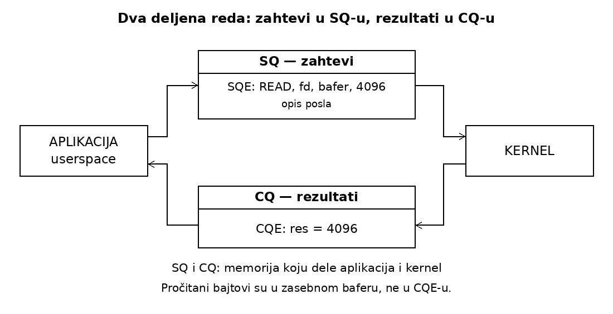

Slika 8. Aplikacija šalje zahteve kroz SQ, a rezultate čita iz CQ. Podaci fajla nalaze se u zasebnom baferu.

### Tok čitanja za klijenta B

Vratimo se trenutku kada je aplikacija primila ceo zahtev B i otvorila fajl koji on traži. Želi da pročita prvih 4096 bajtova u svoj bafer `buf_B`. U opis čitanja upisuje sledeće:

| Podatak | Značenje u primeru |
|---|---|
| Vrsta operacije | Čitanje fajla. |
| `fd` | Deskriptor otvorenog fajla B. |
| `buf_B` | Adresa memorije u koju treba upisati pročitane bajtove. |
| Dužina `4096` | Najviše toliko bajtova treba pročitati. |
| `offset` | Od kog bajta fajla čitamo. |


Tok izgleda ovako:

1. Aplikacija pripremi SQE i učini zahtev dostupnim kroz SQ.
2. Pozivom za slanje obavesti kernel da obradi pripremljene zahteve. U osnovnoj upotrebi to obavlja `io_uring_enter()`.
3. Kernel preuzme zahtev i organizuje čitanje. Isti thread servera u međuvremenu može da obradi mrežne podatke A.
4. Posle čitanja, podaci su u `buf_B`, a kernel doda CQE u CQ.
5. Aplikacija preuzme CQE, proveri rezultat i nastavi slanje odgovora B.

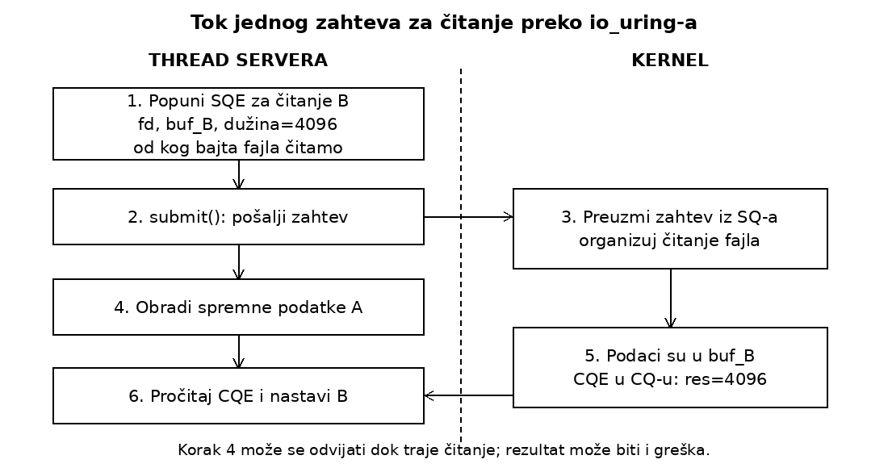

Slika 9. Dok kernel organizuje čitanje B, isti thread servera može da obrađuje A. Posle čitanja dobija zapis sa rezultatom.

U osnovnoj upotrebi `io_uring_submit()` preko `io_uring_enter()` obaveštava kernel o spremnim zahtevima. To ne stvara automatski poseban thread za svako čitanje. Kernel može neke operacije izvršiti odmah, a druge nastaviti kada mogu da napreduju ili izvršiti preko svojih radnika. Aplikacija u svim tim slučajevima rezultat preuzima iz CQ-a.

Ako su i mrežni prijemi zadati preko io_uring-a, isti thread iz CQ-a preuzima rezultate i tih prijema i čitanja fajlova. Ako još nema nijednog rezultata i nema drugog posla, može da čeka novu završenu operaciju. Kada rezultati stignu, preuzima ih i nastavlja odgovarajuće klijentske zahteve.

Ovako uklanjamo konkretan zastoj threada koji izvršava event loop iz odeljka 4: on više ne mora odmah da čeka rezultat čitanja fajla B. Samo korišćenje `io_uring`-a ipak ne ubrzava automatski SSD. Korist nastaje time što čekanje B možemo preklopiti sa drugim poslom.

SQE je opis operacije; bafer je prostor za podatke; CQE je zapis o rezultatu. Na primer, `cqe->res = 4096` znači da je 4096 bajtova pročitano u zadati bafer. Manja pozitivna vrednost znači kraće čitanje, nula kraj fajla, a negativna vrednost kod greške. Samo uspešno slanje zahteva kernelu ne garantuje da je čitanje uspelo.

### Šta se dobija deljenom memorijom?

SQ i CQ nalaze se u memoriji kojoj mogu pristupiti i aplikacija i kernel. Aplikacija ih na početku povezuje sa svojim adresnim prostorom pomoću `mmap()`. To znači da dobija adrese preko kojih može pristupati tim zajedničkim memorijskim oblastima. Ne pravi se odvojena kopija celog reda pri svakom korišćenju.

Zato aplikacija može da pripremi više zahteva u memoriji, a kernel kasnije da im pristupi. Slično, kernel upiše rezultate u CQ, a aplikacija već pristigle rezultate čita iz iste oblasti. Ušteda se odnosi na razmenu SQE opisa operacija i CQE zapisa sa rezultatima. Na primer, CQE prenosi broj pročitanih bajtova ili grešku. Sam sadržaj fajla upisuje se u bafer aplikacije, pa deljeni redovi ne znače da svaki prenos sadržaja radi bez kopiranja.

### Kako rade kružni redovi SQ i CQ?

Ako red ima četiri mesta, ona ne moraju stalno da se pomeraju kada preuzmemo jedan zapis. Pamtimo gde je sledeći zapis za preuzimanje i gde treba upisati novi. Posle poslednjeg mesta nastavljamo od prvog. Takav raspored se naziva kružni bafer, odnosno ring buffer.

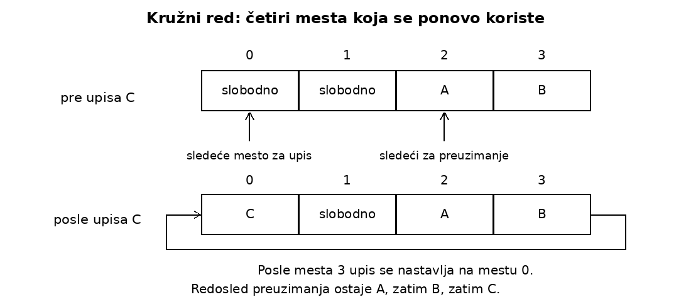

Slika 10. Niz je fizički prav, ali se upis posle kraja vraća na početak. Redosled A, B, C ostaje očuvan.

Na slici A i B čekaju na mestima 2 i 3. Novo C upisujemo u slobodno mesto 0. Redosled čitanja i dalje je A, B, C: fizički položaj u nizu nije isto što i redosled poslova. Zauzeto mesto ne smemo prepisati dok nije oslobođeno. I SQ i CQ koriste ovu osnovnu ideju.

Prikazani brojevi označavaju mesta u nizu. Stvarni interfejs koristi brojače da izračuna sledeće mesto, a `liburing` vodi računa o tim detaljima.

### Gde se nalazi sam SQE?

U osnovnom rasporedu postoji mala razlika između SQ i CQ. SQ čuva brojeve mesta u zasebnom nizu SQE opisa. Ako naredni broj u SQ-u glasi 3, kernel treba da uzme opis `SQE[3]`. To je značenje rečenice da SQ sadrži indekse; indeks je ovde samo broj mesta u nizu. CQ direktno sadrži zapise CQE.

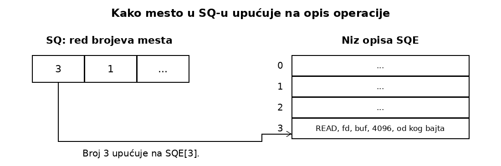

Slika 11. SQ određuje koji SQE kernel treba da preuzme; sam SQE sadrži argumente operacije.

Za program ovaj detalj obično rešava `liburing`: tražimo slobodan SQE, popunimo ga i pošaljemo. Biblioteka postavlja potrebne brojeve mesta i obezbeđuje da kernel ne vidi zahtev kao spreman pre nego što je njegov opis potpuno upisan.

### Grupno slanje i više nezavršenih operacija

Četiri odvojena `read()` poziva zahtevaju četiri ulaska u kernel. Sa `io_uring`-om možemo pripremiti četiri SQE-a i poslati ih jednim pozivom. To je grupno slanje, odnosno batching: trošak poziva deli se na više zahteva. Za čekanje na rezultate operacija mogu biti potrebni dodatni pozivi, a `io_uring_enter()` može kombinovati slanje i čekanje.

Druga korist je mogućnost da pošaljemo sledeću operaciju pre završetka prethodne. Ako unapred znamo koje delove fajla treba pročitati, više čitanja može istovremeno čekati ili biti u obradi. Broj takvih operacija naziva se broj zahteva u letu. Podešavanje queue depth (QD) određuje njihov dozvoljeni maksimum. QD 32 znači do 32 nezavršena zahteva, a ne 32 threada.

Grupa za slanje i QD nisu isto: možemo poslati 32 zahteva pojedinačno, a ipak održavati 32 u letu. Takođe, kernelovo preuzimanje SQE-a nije završetak čitanja. Prostor za opis može postati slobodan ranije, dok bafer sa podacima mora ostati validan sve do završetka.

Završeci ne moraju stići redom slanja. Uz SQE možemo sačuvati identifikator, na primer „čitanje za B“, preko polja `user_data`. Kernel ga vraća u CQE-u, pa aplikacija zna kome rezultat pripada. Time održava vezu između zahteva, bafera i nastavka obrade.

### Isti interfejs za fajlove i mrežu

SQE može opisati čitanje ili pisanje fajla, ali i `accept`, `connect`, `send` ili `recv`. Naš server zato istim tipom interfejsa može da primi poruku, pročita fajl i pošalje odgovor. Redosled zavisnih koraka ostaje važan: ime fajla mora biti poznato pre njegovog otvaranja, a pročitani podaci pre slanja odgovora. Nezavisni zahtevi različitih klijenata mogu napredovati zajedno.

### Mali C primer sa liburing-om

Program čita do 4096 bajtova od početka fajla. `open()` je običan poziv; čitanje opisujemo kroz SQE. Sačuvati kao `read_uring.c`.

```c
#include <errno.h>
#include <fcntl.h>
#include <liburing.h>
#include <stdio.h>
#include <string.h>
#include <unistd.h>

int main(int argc, char **argv)
{
    if (argc != 2) return 1;
    int fd = open(argv[1], O_RDONLY);
    if (fd < 0) { perror("open"); return 1; }
    struct io_uring ring;
    int rc = io_uring_queue_init(2, &ring, 0);
    if (rc < 0) goto close_file;
    char buf[4096];
    struct io_uring_sqe *sqe = io_uring_get_sqe(&ring);
    if (!sqe) { rc = -ENOMEM; goto close_ring; }
    io_uring_prep_read(sqe, fd, buf, sizeof(buf), 0);
    rc = io_uring_submit(&ring);
    if (rc != 1) {
        if (rc >= 0) rc = -EIO;
        goto close_ring;
    }
    struct io_uring_cqe *cqe;
    do { rc = io_uring_wait_cqe(&ring, &cqe); }
    while (rc == -EINTR);
    if (rc < 0) goto close_ring;
    rc = cqe->res;
    if (rc >= 0) printf("Procitano: %d bajtova\n", rc);
    io_uring_cqe_seen(&ring, cqe);
close_ring:
    io_uring_queue_exit(&ring);
close_file:
    close(fd);
    if (rc < 0) fprintf(stderr, "%s\n", strerror(-rc));
    return rc < 0;
}
```
- `io_uring_queue_init()` priprema redove i njihove resurse.
- `io_uring_get_sqe()` daje slobodan SQE koji ćemo popuniti.
- `io_uring_prep_read()` zadaje fajl, bafer, dužinu i početnu poziciju čitanja, ali još ne šalje zahtev.
- `io_uring_submit()` šalje pripremljene zahteve kernelu.
- `io_uring_wait_cqe()` daje zapis o završenoj operaciji i čeka ako još nije dostupan.

`cqe->res` proveravamo zasebno jer uspešno čekanje CQE-a ne znači uspešno čitanje. `io_uring_cqe_seen()` označava da smo rezultat obradili i da se njegovo mesto u CQ-u može ponovo koristiti. `liburing` skriva početno uspostavljanje preko `io_uring_setup()`, mapiranje preko `mmap()` i pozive `io_uring_enter()`.

Ovaj mali primer odmah čeka jednu operaciju. Pokazuje interfejs, ali ne koristi preklapanje: za to bi između slanja i čekanja trebalo obraditi drugi posao ili poslati dodatna čitanja.

## 7. Eksperiment: poređenje mrežnih servera

Cilj eksperimenta bio je da se uporede performanse epoll i io_uring pristupa pri obradi većeg broja mrežnih konekcija. Zato su napravljene dve verzije jednostavnog echo servera, server_epoll.c i server_uring.c. Oba servera koriste jednu nit i klijentu vraćaju iste podatke koje su primili, ali mrežne operacije obrađuju različitim mehanizmima.

Isti program client.c korišćen je za testiranje oba servera. Na svakoj aktivnoj konekciji klijent šalje poruku, čeka i proverava odgovor, a zatim šalje sledeću. Neaktivne konekcije ostaju otvorene, ali ne razmenjuju podatke. Na taj način poredi se ponašanje servera pri različitom broju aktivnih konekcija, kao i uticaj prisustva velikog broja neaktivnih konekcija.

Testovi su izvedeni sa 8, 32 i 128 aktivnih konekcija, kao i sa 8 aktivnih i 1000 neaktivnih konekcija. Korišćene su poruke veličine 64 B i 4 KiB. Konekcije su otvorene pre početka merenja, a komunikacija se odvijala preko localhost-a. Mereni su broj obrađenih poruka u sekundi, prosečno vreme odgovora i CPU vreme servera po poruci. Svaki test pokrenut je tri puta, a prikazane su srednje vrednosti rezultata.

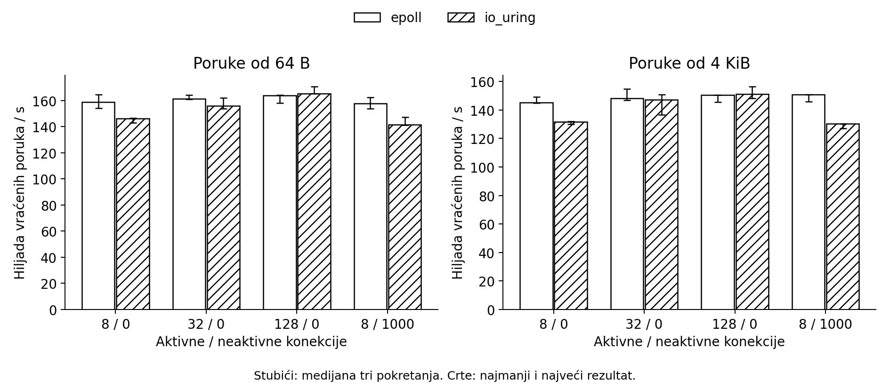

Slika 12. Veći stubić znači više vraćenih poruka u sekundi. Crte prikazuju najmanji i najveći rezultat tri pokretanja.

Sa 8 aktivnih konekcija epoll je bio bolji. io_uring je vraćao 7,9% manje poruka od 64 B i 9,4% manje poruka od 4 KiB u sekundi. Za poruke od 64 B epoll je imao i kraće prosečno vreme odgovora, 46,9 µs prema 50,9 µs, kao i manje CPU vreme servera po poruci, 6,15 µs prema 6,80 µs.

Kako se broj aktivnih konekcija povećavao, prednost epoll-a se smanjivala. Sa 32 konekcije io_uring je zaostajao 3,4% za poruke od 64 B i 0,6% za poruke od 4 KiB. Sa 128 konekcija rezultat se promenio i io_uring je ostvario malu prednost, od 1,1% i 0,5%. Dodavanje 1000 neaktivnih konekcija uz 8 aktivnih nije mu pomoglo: njegov protok bio je 10,3% manji za poruke od 64 B i 13,6% manji za poruke od 4 KiB.

Zašto se rezultat menja sa brojem aktivnih konekcija? Kada ih je malo, nema mnogo operacija koje io_uring može da grupiše, ali i dalje postoji trošak pripreme SQE zapisa i obrade CQE rezultata. Sa više aktivnih konekcija ima više operacija koje se mogu poslati zajedno, pa taj trošak postaje manje značajan. To može objasniti zašto se prednost epoll-a prvo smanjuje, a zatim pri 128 konekcija prelazi u malu prednost io_uring-a. Ipak, test ne meri ove troškove odvojeno, pa ovo ostaje moguće objašnjenje, a ne dokazan uzrok.

Za ovaj zadatak rezultati zato ukazuju da je epoll bolji pri malom broju aktivnih konekcija, dok io_uring pri 128 konekcija ostvaruje nešto veći protok. Ovaj zaključak važi samo za opisane uslove testa. Klijent je koristio približno 98–100% jednog CPU jezgra i mogao je da ograniči rezultat, a komunikacija je obavljana preko localhost-a. Test zato ne pokazuje nužno kako bi se ova dva pristupa ponašala preko fizičke mreže ili kada bi se merila ukupna CPU potrošnja sistema.

[Sva pokretanja i izvorni podaci](https://github.com/emilijadjordjevic/io_uring/actions/runs/37431815130)

## 8. Upotreba i izbor modela

`io_uring` ima stvarne primene. RocksDB ima putanju za grupna čitanja u `MultiRead`, iako sama funkcija prema pozivaocu ostaje sinhrona. Dokumentacija opisuje i opcioni asinhroni I/O za određene upite preko `ReadOptions.async_io`. Rust paket `tokio-uring` nudi posebno okruženje za izvršavanje asinhronih zadataka i operacije nad fajlovima i TCP/UDP; to nije podrazumevani interfejs standardnog Tokio runtime-a.

Libuv dokumentacija opisuje Linux mrežne operacije preko `epoll`-a, a rad nad fajlovima preko thread pool-a. Takva kombinacija ostaje praktična. `io_uring` je Linux-specifičan, mogućnosti zavise od kernela, a prelazak zahteva promenu upravljanja zahtevima i baferima. Prenosivost, zrelost i jednostavnost zato i dalje utiču na izbor.

Počeli smo od jednog threada koji čeka A i odlaže B. Dodatni thread omogućio je obradu B, a pool ograničio broj radnika. Event loop sa `epoll`-om omogućio je zajedničko čekanje mnogih konekcija; čitanje fajla zatim smo izdvojili iz event loop-a. Asinhroni interfejs razdvojio je zadavanje operacije od njenog rezultata, a `io_uring` tu razmenu organizuje kroz deljene kružne redove.

Ovi pristupi zato ostaju korisni u različitim kombinacijama. Korist od `io_uring`-a najviše zavisi od toga koliko nezavisnih operacija aplikacija može da preklopi ili pošalje zajedno. Za niz zavisnih koraka blokirajući model može ostati sasvim dovoljan.

## Literatura

- R. H. Arpaci-Dusseau i A. C. Arpaci-Dusseau, OSTEP: [I/O Devices](https://pages.cs.wisc.edu/~remzi/Classes/537/Spring2018/Book/file-devices.pdf) i [Event-Based Concurrency](https://pages.cs.wisc.edu/~remzi/OSTEP/threads-events.pdf).
- Shuveb Hussain, [Lord of the io_uring](https://unixism.net/loti/), naročito [What is io_uring?](https://unixism.net/loti/what_is_io_uring.html) — uvod u mentalni model i praktičan rad sa interfejsom.
- Jens Axboe, [Efficient IO with io_uring](https://kernel.dk/io_uring.pdf), dostupno i kao [arhivirana kopija](https://web.archive.org/web/20251010072644/https://kernel.dk/io_uring.pdf) — motivacija i izvorni dizajn.
- Linux i liburing priručnici: [epoll(7)](https://man7.org/linux/man-pages/man7/epoll.7.html), [epoll_ctl(2)](https://man7.org/linux/man-pages/man2/epoll_ctl.2.html), [aio(7)](https://man7.org/linux/man-pages/man7/aio.7.html), [io_submit(2)](https://man7.org/linux/man-pages/man2/io_submit.2.html), [io_uring(7)](https://man7.org/linux/man-pages/man7/io_uring.7.html), [io_uring_setup(2)](https://man7.org/linux/man-pages/man2/io_uring_setup.2.html) i [io_uring_enter(2)](https://man7.org/linux/man-pages/man2/io_uring_enter.2.html).
- Funkcije primera: [queue_init](https://man7.org/linux/man-pages/man3/io_uring_queue_init.3.html), [get_sqe](https://man7.org/linux/man-pages/man3/io_uring_get_sqe.3.html), [prep_read](https://man7.org/linux/man-pages/man3/io_uring_prep_read.3.html), [submit](https://man7.org/linux/man-pages/man3/io_uring_submit.3.html) i [wait_cqe](https://man7.org/linux/man-pages/man3/io_uring_wait_cqe.3.html).
- Dokumentacija projekata: RocksDB [Asynchronous IO](https://github.com/facebook/rocksdb/wiki/Asynchronous-IO) i [io_posix.cc](https://github.com/facebook/rocksdb/blob/main/env/io_posix.cc); [tokio-uring](https://docs.rs/tokio-uring/latest/tokio_uring/); libuv [Design overview](https://docs.libuv.org/en/v1.x/design.html) i [File system operations](https://docs.libuv.org/en/v1.x/fs.html). Primeri upotrebe provereni 4. oktobra 2026.

- Dodatno za mrežni prijem i keš: [recv(2)](https://man7.org/linux/man-pages/man2/recv.2.html), [tcp(7)](https://man7.org/linux/man-pages/man7/tcp.7.html), [Linux networking](https://docs.kernel.org/networking/scaling.html), [Page Cache](https://docs.kernel.org/mm/page_cache.html), [open(2), O_DIRECT](https://man7.org/linux/man-pages/man2/open.2.html) i [mmap(2)](https://man7.org/linux/man-pages/man2/mmap.2.html).
